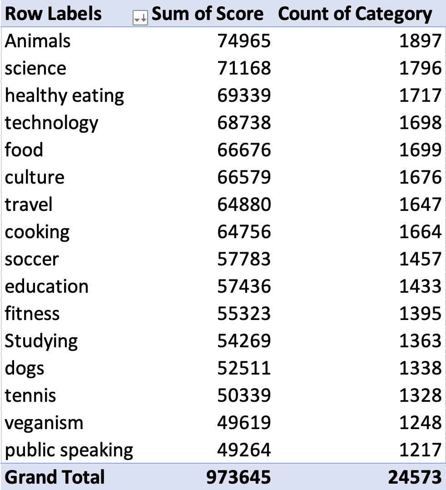
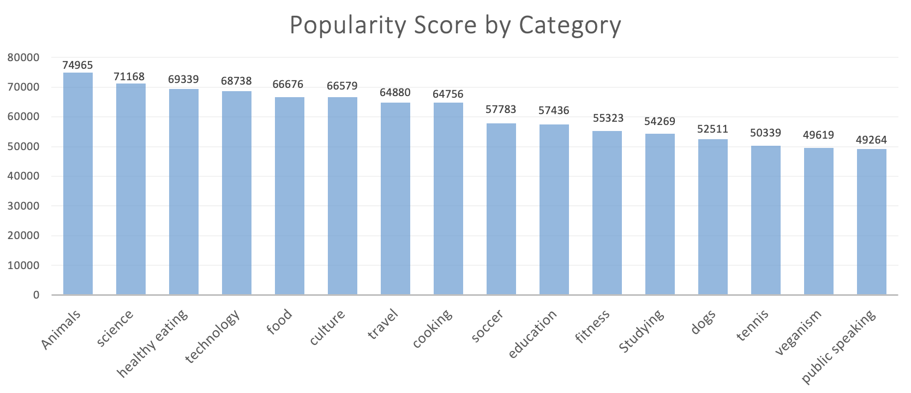
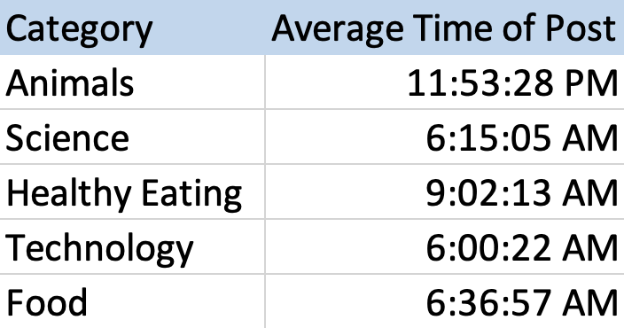

Accenture Virtual Internship

In the virtual experience internship program with Accenture, I identified a client's top categories for engagement on their platform. I joined data with VLOOKUP and summarized the data with pivot tables and SUMIF functions.

The first image below is the pivot table where I summed up the scores for each category to calculate a popularity value. A count of the number of posts per category is also featured in the pivot table. The table is ordered beginning from the greatest popularity score to the lowest.

The following two images are of the graphs I generated to show the the ranking of the top categories and the total makeup of the categories across posts on the whole platform. 

I also identified the avereage time of day users liked to post for the top 5 categories. This can change the client's ad targeting strategy to distrubute advertisements on their media platform at specific times of day to increase user engagement for certain categories.

